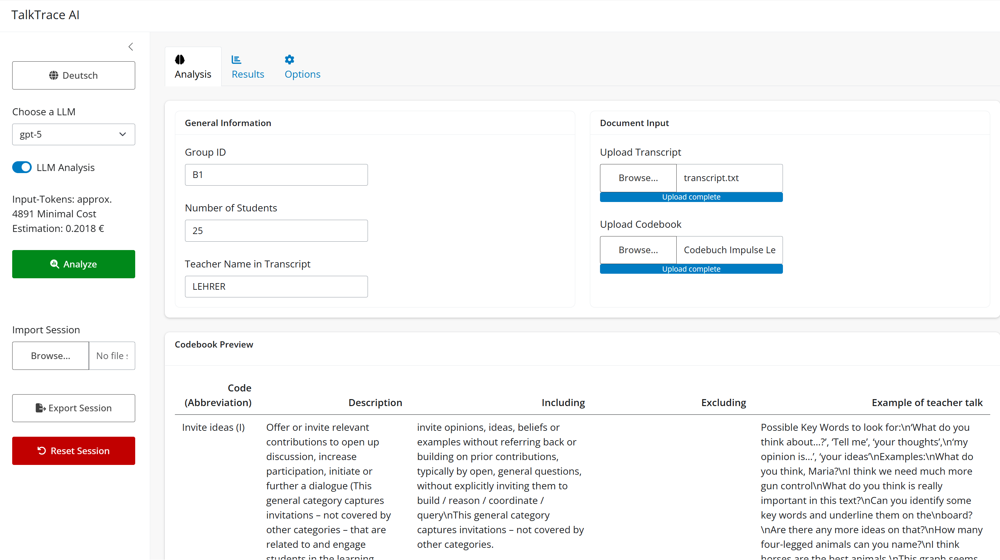
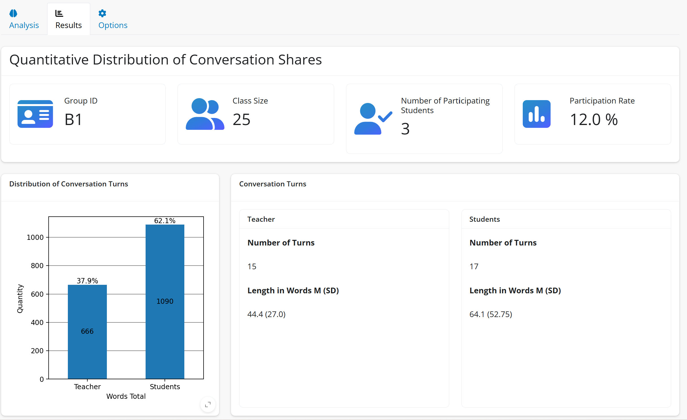
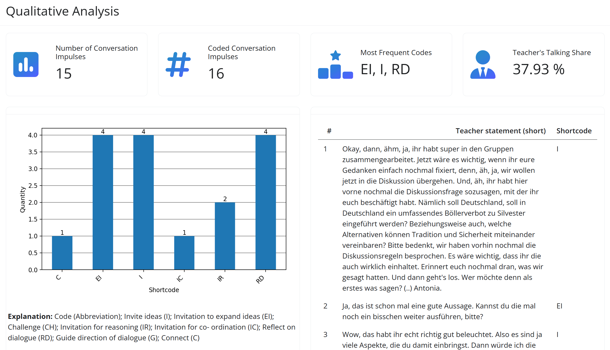
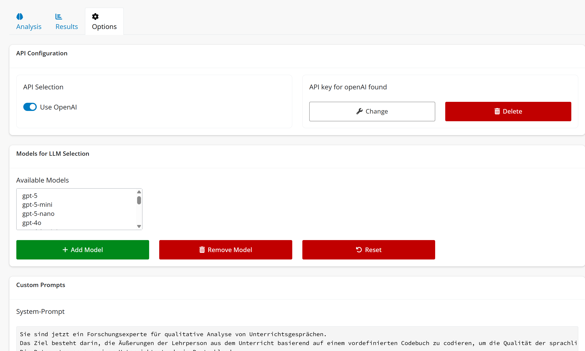

## About

TalkTrace-AI is a FLOSS, platform independent webapp for evaluating the performance of teaching students during class room simulation, leveraging the power of Large Language Models (LLMs). It will provide both quantitative and qualitative reports of the verbal classroom performance and allows for customization of the analysis parameters. It was built Shiny for Python web application. It provides an interactive web interface for users to engage with data and visualizations. An API-Key for either OpenAI or groq is required to perform qualitative analysis.

## Installation
Install the TalkTrace package on your python 3 via

`pip install talktrace`
In some scenarios, you may need to run

`python3 -m pip install talktrace`

## Usage
To run the web application, from terminal simply run

`talktrace`

or

`python3 -m talktrace`

Once the application is running, it will automatically open the interface in your webbrowser at http://localhost:8000.

## Interface
The process of TalkTrace-AI is organized into 2 steps/tabs: Analysis and Results. The app-sidebar gives you quick options control for the analysis, e.g. enabling/changing LLM analysis, store/restore Session, etc.

#### Analysis



Under the Analysis tab, you can provide general information like the group and identifiers of the group. **Important:** You need to specify the **name of the teaching person in the transcript**, otherwise TalkTrace-AI will not be able to correctly identify the teacher and calculate accurate metrics. 

To run the analysis, at least transcript is required, which may be uploaded via the Document Input panel. Transcript need to follow the scheme of [noScribe](https://github.com/kaixxx/noScribe) for the parsing to work, i.e 
```"S01: Utterance"
"S02: Utterance"
"S01: Utterance"
"S04: Utterance"```
 ... an so on.

If both quanitative and qualitative analysis is needed, a codebook is required as well (see the example file provided). 
After upload, the analysis is started via the Analyze button in the sidebar. When results are ready, TalkTrace-AI automatically switches to the results tab
**Note:** Token prediction in the sidebar provides only a very rough estimate of the minimal expected costs. It is based on the length of the provided transcript/codebook, the LLM input token costs and and estimate of 4 times the output tokens. Since LLMs may provide significantly longer answers (especially reasoning models), only a lower bound can be predicted. Actual token usage may be checked via the LLM providers metrics.  

#### Results
The Results section is organized into quantitative and qualitative analysis. Only the latter is performed by a LLM, quantitative results are calculated using pattern matching and basic mathematical operations.

Quantitative Results provides basic metrics and a visualization on the class participation and the distribution of conversation shares (both relative an absolute measures).



Qualitative Results provide the coding of the LLM based on the uploaded codebook. Additionally, basic metrics and a visualization on the distribution of codes are highlighted above the textual display.



### Options
The Options tab allows for configuration of app settings.
If an LLM is used for qualitative analysis, TalkTrace-AI needs an API-key to communicate with LLM-backend, which can be added, changed or deleted in the _API configuration_ settings. Selection of the LLM-Client is possible as well, with openAI and Groq as choices.

The preconfigured list of LLM Models can be edited in the section on _Models for LLM Selection_, which will update the available choices in the sidebar in realtime. This makes it possible to add new models or to exercise control over the used LLMs.

Custom System and User Prompts for the LLM can be configured in the _Custom Prompts section_, to meet specific analysis requirements. In case of doubt, prompts can be reset to the app default.

In the _Additional Options Panel_ allows to change the default values for teacher name, group ID and class size.

The configuration is stored locally on the app folder and can be partially reset via the according reset button.      


  


## Privacy Note
TalkTrace-AI does not store transcripts or analysis results on any external server. All data needed for preparing and displaying an analysis are held in local memory in the browser during interaction with the tool. Since LLM-models are not hosted locally, the application backend communicates with external large language models during the qualitative coding step. When qualitative coding is enabled, the relevant parts of the transcript and the codebook are transmitted to the selected LLM provider via the configured API. Any server-side storage or logging of these data therefore depends on the data protection policies and technical settings of the chosen LLM service. Raw LLM output and session data can be stored locally for later reuse via the export and import session controls, and processed outputs can be downloaded as result reports. API keys are stored securely in the operating system’s encrypted password vault. This architecture supports institutions that prefer to keep teaching and research data under their own control and aligns with recommendations that AI-supported analytics should be designed to minimise unnecessary data retention on external services. 

## Credits
TalkTrace-AI is being developed by Jami Schorling (https://orcid.org/0009-0005-9007-2896) and Dennis Hauk (https://orcid.org/0000-0002-5779-2876) at the [Chair for Research on Teaching and Learning in Civic Education at Leipzig University](https://www.sozphil.uni-leipzig.de/institut-fuer-politikwissenschaft/arbeitsbereiche/professur-fuer-fachdidaktik-gemeinschaftskunde/team/prof-dr-dennis-hauk) in Germany. 

## Contributing
Contributions are welcome! Please submit a pull request or open an issue for any enhancements or bug fixes on github.

## License
This project is licensed under the CC BY-NC 4.0 License. See the LICENSE file for more details. Let's socialize software for the open-source democratic stack!


