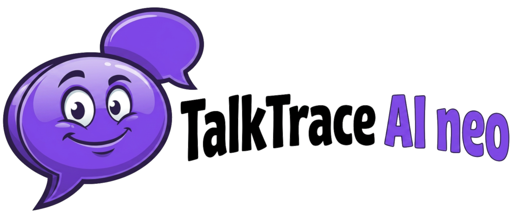
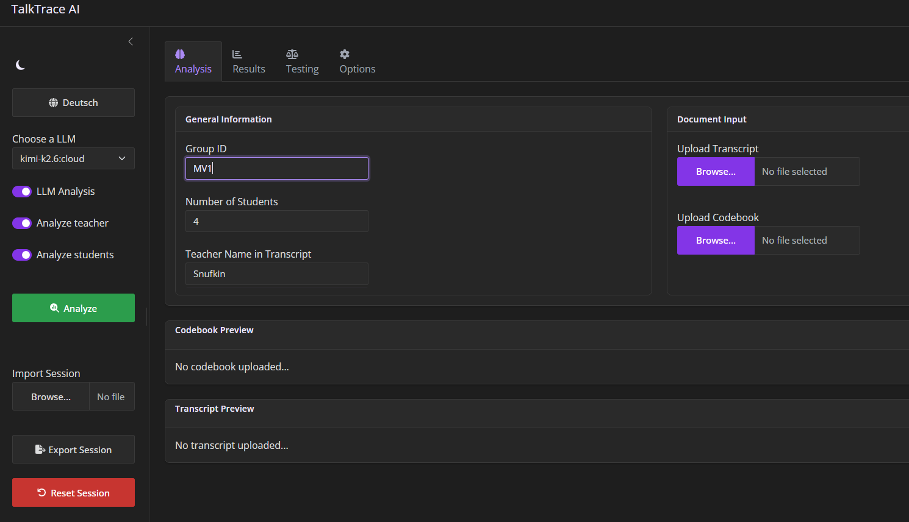
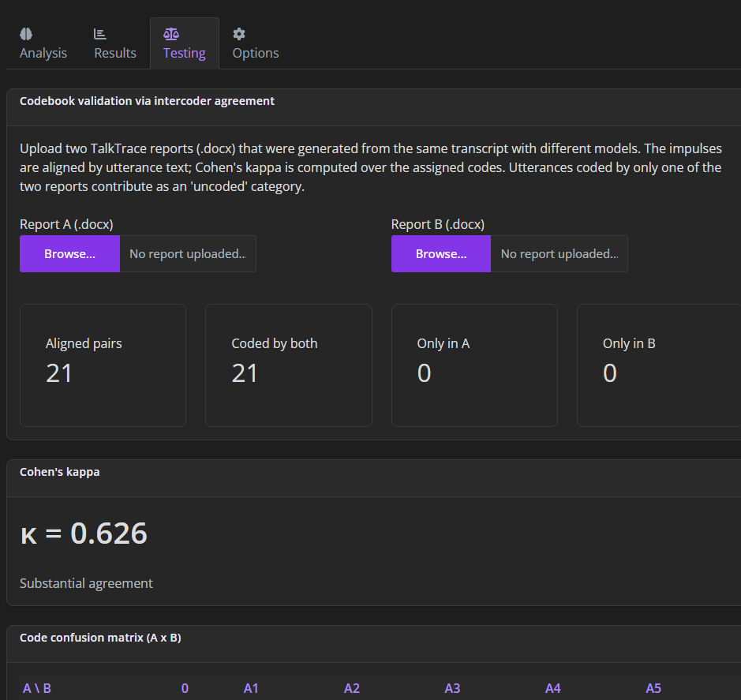
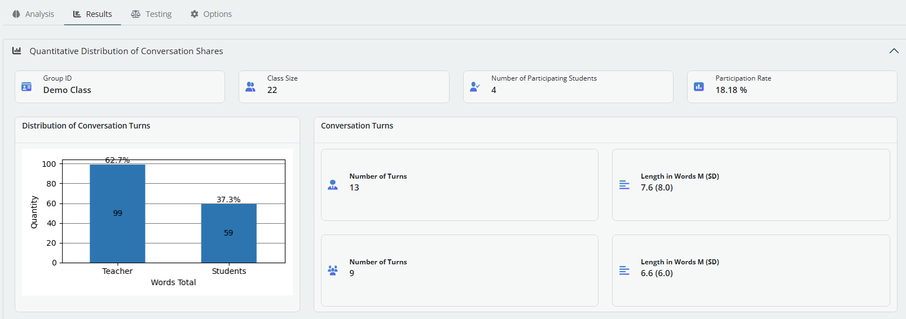
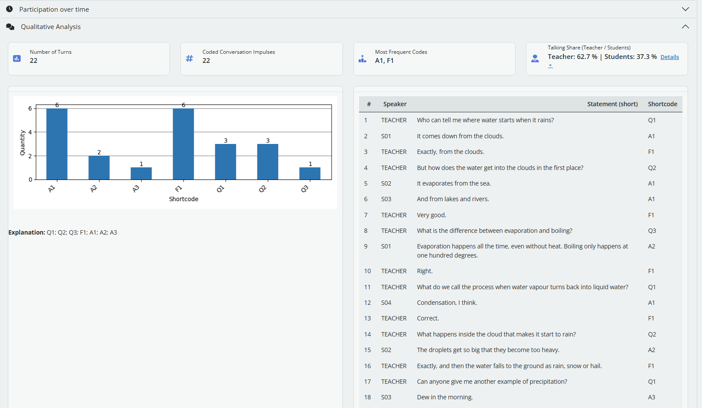
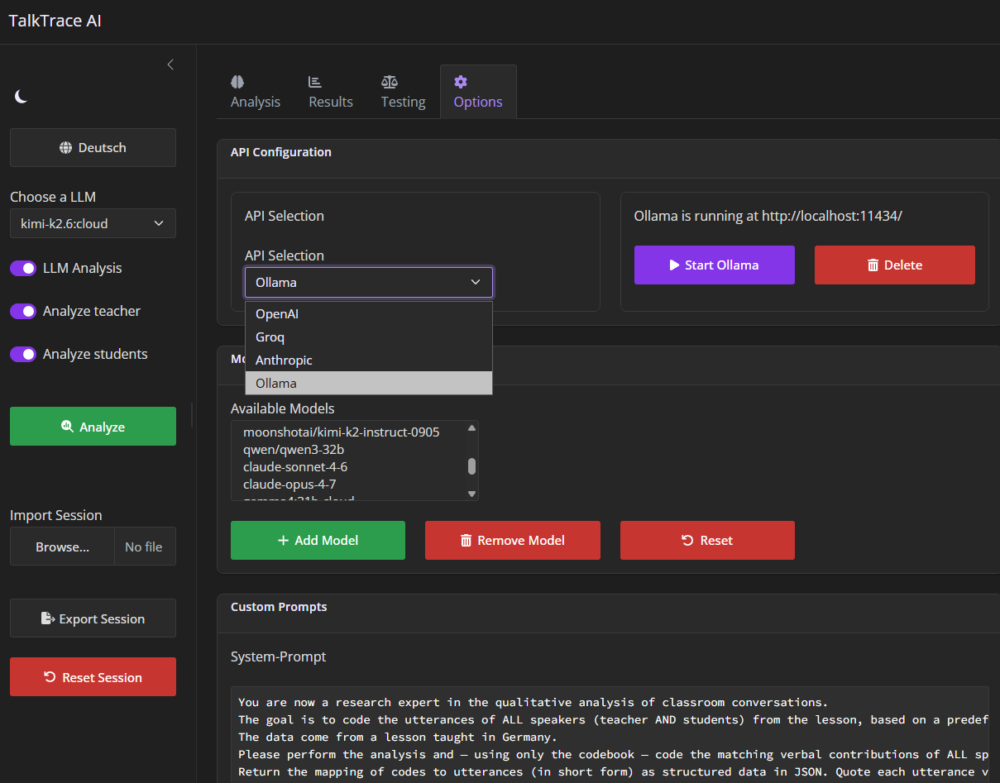
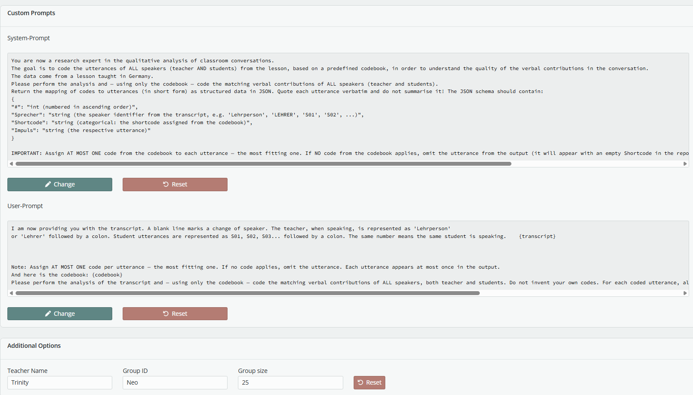

# TalkTrace AI neo
<p align="center">
    <picture>
        <source media="(prefers-color-scheme: light)" srcset="images/logo_white.png">
        <source media="(prefers-color-scheme: dark)" srcset="images/logo_black.png">
        
    </picture>
</p>

## About

TalkTrace-AI-neo is a work in progress project (fork) based on TalkTrace-AI (source). It extends the usage for dialogue without teacher present (e.g. small group discussion) and implements quality of life functions (e.g. dark-mode, ollama cloud api, see below for present changes)

TalkTrace-AI is a FLOSS, platform independent webapp for evaluating the performance of teaching students and students itself during class room simulation, leveraging the power of Large Language Models (LLMs). It will provide both quantitative and qualitative reports of the verbal classroom and small group performance and allows for customization of the analysis parameters. It was built Shiny for Python web application. It provides an interactive web interface for users to engage with data and visualizations. API-Keys will be needed for OpenAI, Groq and Anthropic (cost/token). Ollama can be installed and the free-tier allows to run cloud-based API from Ollama's servers (no cost).

## What's New

- **Dark mode**: Obsidian-inspired dark theme, toggled from the sidebar.

<p align="center">
  
</p>

- **Ollama Cloud support**: new API client for Ollama alongside OpenAI, Groq, and Anthropic. Requires a local Ollama installation; `*-cloud` models additionally require an Ollama cloud subscription (free tier is often enough).
- **Qualitative coding of student utterances**: the LLM now codes speech acts of students as well, not only the teacher. Output JSON carries a `Sprecher` field (e.g. `Lehrperson`, `S01`, `S02`) and the Results tab shows per-speaker statistics.
- **Analysis without a teacher**: specifying a teacher name is now optional — qualitative analysis runs even if no teacher is present in the transcript.
- **Windows launcher `start.bat`**: bootstraps a local `.venv`, installs dependencies, and starts the app. Flags: `/reinstall` (rebuild venv), `/nowindow` (start headless without the desktop window).
- **Updated prompts**: system and user prompts were adjusted to the new capabilities (multi-speaker coding, optional teacher).
- **Added feature**: now you can upload two reports of the same dialogue analysis done with two different LLMs and you will get the *Cohen's Kappa* of the ICR.

<p align="center">
  
</p>

## Quickstart per OS

The repository ships with launch helpers that create a virtual environment, install dependencies, and start the app.

### Windows
Double-click `start.bat`, or run from a terminal:
```
start.bat
```

### macOS
```
chmod +x start.sh
./start.sh
```
No additional system dependencies are required — the native window uses the Cocoa/WebKit backend that ships with macOS.

### Linux
```
chmod +x start.sh
./start.sh
```
For a native desktop window, install the WebKit/GTK bindings (Debian/Ubuntu):
```
sudo apt install gir1.2-webkit2-4.1 python3-gi
```
Without those packages, the app automatically falls back to opening in your default browser.

**Linux limitations:**
- PDF report export is not available on Linux (relies on Microsoft Word). Export to DOCX instead.
- Without a system keyring (GNOME Keyring / KWallet via SecretService), API keys are kept only for the running session. The app installs `keyrings.alt` as a file-based fallback, but you can also start the keyring daemon (`gnome-keyring-daemon` or similar) for persistent storage.

### Common flags
- `--reinstall` — recreate the virtual environment from scratch
- `--nowindow` — start headless (no native window); use a browser to visit http://localhost:8000

**Ollama Cloud:** the `*-cloud` models require a local [Ollama](https://ollama.com/) installation *and* an Ollama cloud subscription. Working cloud models are (April 2026): Gemma4:31b-cloud, kimi-2.6:cloud, glm-5.1:cloud (usable with free tier).

## Interface
The process of TalkTrace-AI is organized into 2 steps/tabs: Analysis and Results. The app-sidebar gives you quick options control for the analysis, e.g. enabling/changing LLM analysis, store/restore Session, etc.

#### Analysis

Under the Analysis tab, you can provide general information like the group and identifiers of the group. Specifying the **name of the teaching person in the transcript** is recommended so that TalkTrace-AI can correctly identify the teacher and calculate teacher-specific metrics, but it is no longer mandatory — qualitative analysis also runs on transcripts without a teacher.

To run the analysis, at least a transcript is required, which may be uploaded via the Document Input panel. Transcripts need to follow the scheme of [noScribe](https://github.com/kaixxx/noScribe) for the parsing to work - but there is new feature allowing you to transform your transcript into the right format (e.g. transcripts from [aTrain](https://github.com/JuergenFleiss/aTrain)

If both quantitative and qualitative analysis is needed, a codebook is required as well (see the [example file](images/Example%20Codebook.docx)). Qualitative codes are applied to **all speakers** — teacher *and* student utterances — so the codebook may target speech acts of students (SuS) as well.
After upload, the analysis is started via the Analyze button in the sidebar. When results are ready, TalkTrace-AI automatically switches to the results tab
**Note:** Token prediction in the sidebar provides only a very rough estimate of the minimal expected costs. It is based on the length of the provided transcript/codebook, the LLM input token costs and and estimate of 4 times the output tokens. Since LLMs may provide significantly longer answers (especially reasoning models), only a lower bound can be predicted. Actual token usage may be checked via the LLM providers metrics.  

#### Results
The Results section is organized into quantitative and qualitative analysis. Only the latter is performed by a LLM, quantitative results are calculated using pattern matching and basic mathematical operations.

Quantitative Results provides basic metrics and a visualization on the class participation and the distribution of conversation shares (both relative an absolute measures).

<p align="center">
  
</p>

Qualitative Results provide the coding of the LLM based on the uploaded codebook. Each coded utterance carries a `Sprecher` label (e.g. `Lehrperson`, `S01`, `S02`), and results are broken down per speaker so that teacher contributions and individual student contributions can be inspected separately. Basic metrics and a visualization of the distribution of codes are highlighted above the textual display; sections without matching data show a "No data" placeholder.

<p align="center">
  
</p>

### Options
The Options tab allows for configuration of app settings.

<p align="center">
  
</p>

If an LLM is used for qualitative analysis, TalkTrace-AI needs an API-key to communicate with the LLM-backend, which can be added, changed or deleted in the _API configuration_ settings. Selection of the LLM-Client is possible as well, with **OpenAI, Groq, Anthropic and Ollama** as choices. For Ollama the app detects whether a cloud API key is configured and otherwise falls back to a local Ollama instance on `localhost`.

The sidebar additionally exposes a **dark-mode toggle** (Obsidian-inspired theme) and a **language switch (EN/DE)** via the globe icon.

The preconfigured list of LLM Models can be edited in the section on _Models for LLM Selection_, which will update the available choices in the sidebar in realtime. This makes it possible to add new models or to exercise control over the used LLMs.

Custom System and User Prompts for the LLM can be configured in the _Custom Prompts section_, to meet specific analysis requirements. In case of doubt, prompts can be reset to the app default.

<p align="center">
  
</p>

In the _Additional Options Panel_ allows to change the default values for teacher name, group ID and class size.

The configuration is stored locally on the app folder and can be partially reset via the according reset button.      

## Privacy Note
TalkTrace-AI does not store transcripts or analysis results on any external server. All data needed for preparing and displaying an analysis are held in local memory in the browser during interaction with the tool. Since LLM-models are not hosted locally, the application backend communicates with external large language models during the qualitative coding step. When qualitative coding is enabled, the relevant parts of the transcript and the codebook are transmitted to the selected LLM provider via the configured API. Any server-side storage or logging of these data therefore depends on the data protection policies and technical settings of the chosen LLM service. Raw LLM output and session data can be stored locally for later reuse via the export and import session controls, and processed outputs can be downloaded as result reports. API keys are stored securely in the operating system’s encrypted password vault. This architecture supports institutions that prefer to keep teaching and research data under their own control and aligns with recommendations that AI-supported analytics should be designed to minimise unnecessary data retention on external services. 

## Credits
TalkTrace-AI-neo is a fork of TalkTrace-AI and in ongoing development.
TalkTrace-AI is being developed by Jami Schorling (https://orcid.org/0009-0005-9007-2896) and Dennis Hauk (https://orcid.org/0000-0002-5779-2876) at the [Chair for Research on Teaching and Learning in Civic Education at Leipzig University](https://www.sozphil.uni-leipzig.de/institut-fuer-politikwissenschaft/arbeitsbereiche/professur-fuer-fachdidaktik-gemeinschaftskunde/team/prof-dr-dennis-hauk) in Germany. 

## Contributing
Contributions are welcome! Please submit a pull request or open an issue for any enhancements or bug fixes on github.

## License
This project is licensed under the CC BY-NC 4.0 License. See the LICENSE file for more details. Let's socialize software for the open-source democratic stack!


