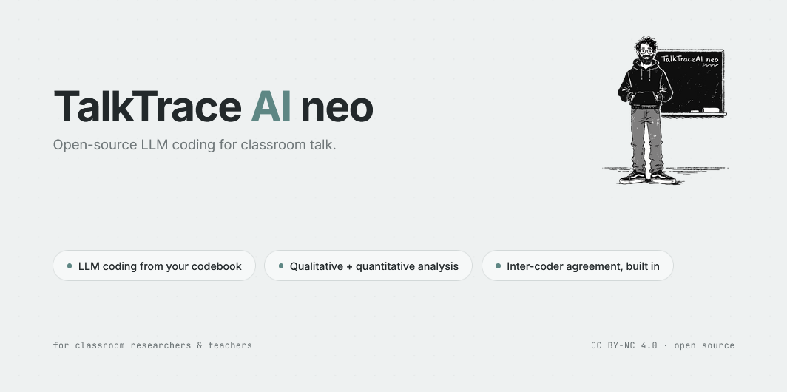

# TalkTrace AI neo

<p align="left">
    <picture>
        <source media="(prefers-color-scheme: light)" srcset="images/light.png">
        <source media="(prefers-color-scheme: dark)" srcset="images/light.png">
        
    </picture>
</p>

> **New: Autopilot.** A dedicated tab automates the two-LLM workflow needed for inter-coder reliability: upload transcript and codebook once, choose two different models, click *Start*. The autopilot codes the transcript sequentially with each model, stores both runs as session pickles in the history, and forwards them straight to the Testing tab — Cohen's κ, Krippendorff's α, and the per-code confusion matrix appear without any further clicks. If only the second run fails, the first is kept and a *Retry B only* button avoids a full re-run. See [What's New in `neo`](#whats-new-in-neo) below for details.

## About

**TalkTrace-AI-neo** is an actively developed fork of [TalkTrace-AI](<!-- TODO: upstream repository URL -->), a FLOSS (Free/Libre Open Source Software), platform-independent web application for analysing verbal interaction in classroom and small-group settings. Built on [Shiny for Python](https://shiny.posit.co/py/), it leverages Large Language Models (LLMs) to produce both **quantitative** metrics (participation, conversation shares) and **qualitative** coding (speech acts) of transcribed dialogues, and exports them as structured reports.

The `neo` fork extends the original tool toward dialogue analysis **without a teacher present** (e.g. small-group student discussions), adds quality-of-life features such as a custom light and dark theme system and Ollama Cloud support, and introduces utilities for inter-coder reliability assessment. See [What's New in `neo`](#whats-new-in-neo) for the full list of changes.

**Supported LLM backends:**

- [OpenAI](https://platform.openai.com/) — paid API
- [Groq](https://groq.com/) — paid API
- [Anthropic](https://www.anthropic.com/api) — paid API
- [Ollama](https://ollama.com/) — local (free) or Ollama Cloud (free tier available, paid for extended usage)

## Quickstart

The repository ships with launch helpers that create a virtual environment, install dependencies, and start the app.

<details>
<summary><strong>Prerequisites</strong></summary>

<p><strong>Python ≥ 3.12 is required</strong> (development and testing target: 3.13). Check your installed version with <code>python --version</code> (Windows) or <code>python3 --version</code> (macOS/Linux); if it is below 3.12, install or upgrade as described below.</p>

<ul>
<li><strong>Windows</strong> — download from the <a href="https://www.python.org/downloads/windows/">official Python website</a>. During installation, ensure the option <em>"Add python.exe to PATH"</em> is enabled, otherwise <code>start.bat</code> will not locate the interpreter when bootstrapping the virtual environment.</li>
<li><strong>macOS</strong> — the Python interpreter shipped with macOS is typically outdated (Sequoia, for instance, ships with 3.9). Install a current version from <a href="https://www.python.org/downloads/macos/">python.org</a> or via <a href="https://brew.sh/">Homebrew</a> (<code>brew install python@3.13</code>).</li>
<li><strong>Linux</strong> — Python 3.13 is not yet present in the default repositories of many distributions. On Debian/Ubuntu, the <a href="https://launchpad.net/~deadsnakes/+archive/ubuntu/ppa">deadsnakes PPA</a> provides current builds; for fully version-managed setups, <a href="https://github.com/pyenv/pyenv"><code>pyenv</code></a> is recommended.</li>
</ul>

</details>

### Windows

Double-click `start.bat`, or run from a terminal:

```bat
start.bat
```

### macOS

```bash
chmod +x start.sh
./start.sh
```

No additional system dependencies are required — the native window uses the Cocoa/WebKit backend that ships with macOS.

### Linux

```bash
chmod +x start.sh dev.sh
./start.sh
```

On Debian/Ubuntu/Mint the system Python ships without the `venv` and `ensurepip` modules. `start.sh` detects this and offers to install `python3-venv` and `python3-pip` via `apt` (with a single `sudo` password prompt) — equivalent helpers exist for `dnf` and `pacman`. No manual setup required.

For a native desktop window, install the WebKit/GTK bindings (Debian/Ubuntu):

```bash
sudo apt install gir1.2-webkit2-4.1 python3-gi
```

Without those packages, the app automatically falls back to opening in your default browser.

> **Note on line endings.** If you cloned or downloaded the repository on Windows and copied it to a Linux machine, the `.sh` files may carry CRLF line endings and silently fail to launch. Convert them once with `sed -i 's/\r$//' start.sh dev.sh` (or `dos2unix start.sh dev.sh`).

<details>
<summary><strong>Linux limitations</strong></summary>
<ul>
<li>PDF report export is not available (the export pipeline relies on Microsoft Word). Export to DOCX instead.</li>
<li>Without a system keyring (GNOME Keyring / KWallet via SecretService), API keys are kept only for the running session. The app installs <code>keyrings.alt</code> as a file-based fallback; alternatively, start a keyring daemon (e.g. <code>gnome-keyring-daemon</code>) for persistent storage.</li>
</ul>
</details>

### Launcher flags

| Flag (Unix) | Flag (Windows) | Effect |
|---|---|---|
| `--reinstall` | `/reinstall` | Recreate the virtual environment from scratch |
| `--nowindow` | `/nowindow` | Start headless; access the app at <http://localhost:8000> |
| `--setup-only` | — | Provision the venv and dependencies, then exit without launching the app |

### Development mode (hot-reload)

For active development, use `dev.bat` (Windows) or `./dev.sh` (Linux/macOS) instead of the regular launcher. These scripts run the app under `shiny run --reload`, which auto-restarts the server whenever a `.py` file under `talktrace_ai/` is saved — no manual close/relaunch needed.

```bash
./dev.sh           # Linux / macOS
```
```bat
dev.bat            REM Windows
```

The dev launcher opens the app in your default browser instead of the pywebview desktop window, so the browser's DevTools and tab refresh remain available. On a fresh checkout, `dev.sh` performs the same one-shot setup as `start.sh` (Python detection, venv creation, dependency install, distro-specific package installs); subsequent runs start instantly. Stop the server with `Ctrl+C`.

### Ollama Cloud

The `*-cloud` models require **both** a local [Ollama](https://ollama.com/) installation **and** an Ollama Cloud subscription. Cloud models confirmed to work as of April 2026 are `Gemma4:31b-cloud`, `kimi-2.6:cloud`, and `glm-5.1:cloud` (all usable on the free tier; slow on peak user times).

## Interface

The workflow is organised into four main tabs — **Analysis**, **Results**, **Testing**, and **Autopilot** — plus an **Options** tab for configuration. The sidebar provides shortcuts for LLM selection, session save/restore, a dark-mode toggle, and a language switch (EN/DE).

<details>
<summary><strong>Analysis tab</strong></summary>

<p>The Document Input panel accepts the following inputs:</p>
<ul>
<li><strong>Transcript</strong> <em>(required)</em> — must follow the <a href="https://github.com/kaixxx/noScribe">noScribe</a> format. A built-in converter transforms transcripts produced by other tools (e.g. <a href="https://github.com/JuergenFleiss/aTrain">aTrain</a>) into the expected schema.</li>
<li><strong>Codebook</strong> <em>(required for qualitative analysis)</em> — see the <a href="images/Example%20Codebook.docx">example codebook</a>. Codes are applied to <strong>all speakers</strong> (teacher and students), so codebooks may equally target student speech acts.</li>
<li><strong>Teacher name</strong> <em>(optional)</em> — providing the teacher's identifier as it appears in the transcript enables teacher-specific metrics. If omitted, qualitative analysis still runs over all speakers.</li>
<li><strong>Group identifier and metadata</strong> — used for report labelling.</li>
</ul>
<p>The analysis is started via the <strong>Analyze</strong> button in the sidebar. On completion, the app switches automatically to the Results tab.</p>
<blockquote>
<strong>Note on token prediction.</strong> The cost estimate displayed in the sidebar is a <em>lower bound</em> only. It is computed from transcript and codebook length, the provider's input-token cost, and an assumed output ≈ 4 × input ratio. Reasoning models in particular may produce substantially longer outputs. Actual usage should be verified via the provider's own metrics.
</blockquote>

</details>

<details>
<summary><strong>Results tab</strong></summary>

<p>Results are split into a quantitative and a qualitative section.</p>
<p><strong>Quantitative results</strong> are computed deterministically (pattern matching, basic arithmetic) and report participation metrics together with visualisations of conversation shares (absolute and relative).</p>
<p align="center">
  
</p>
<p><strong>Qualitative results</strong> are produced by the selected LLM on the basis of the uploaded codebook. Each coded utterance carries a <code>Sprecher</code> label (<code>Lehrperson</code>, <code>S01</code>, <code>S02</code>, …), and statistics are reported per speaker, so that teacher contributions and individual student contributions can be inspected separately. Code distributions are summarised above the textual display; sections without matching data show a <em>No data</em> placeholder.</p>
<p align="center">
  
</p>

</details>

<details>
<summary><strong>Testing tab</strong></summary>
<p>Two analysis reports of the same transcript produced with different LLMs can be uploaded to compute <a href="https://en.wikipedia.org/wiki/Cohen%27s_kappa">Cohen's κ</a> for the qualitative coding.</p>
<p align="center">
  
</p>
</details>

<details>
<summary><strong>Options tab</strong></summary>

<p align="center">
  
</p>
<ul>
<li><strong>API configuration</strong> — manage API keys for OpenAI, Groq, Anthropic, and Ollama. For Ollama, the app detects a configured cloud key and otherwise falls back to a local Ollama instance on <code>localhost</code>.</li>
<li><strong>Models for LLM Selection</strong> — edit the list of selectable models; changes propagate to the sidebar in real time.</li>
<li><strong>Custom Prompts</strong> — modify the system and user prompts used for qualitative coding to fit specific analytical requirements; defaults can be restored at any time.</li>
<li><strong>Additional Options</strong> — adjust the default values for teacher name, group ID, and class size.</li>
</ul>
<p>The configuration is stored locally in the app folder and can be partially reset via the corresponding button.</p>
<p align="center">
  
</p>

</details>

## What's New in `neo`

The following extensions and changes distinguish `neo` from the upstream TalkTrace-AI:

<details>
<summary><strong>Autopilot — one-click two-LLM coding for inter-coder reliability</strong></summary>
<p>Inter-coder reliability between two LLMs traditionally requires the user to run the same transcript twice — switching the active model in between, exporting each report, and uploading both files into the Testing tab. The new <strong>Autopilot</strong> tab collapses this into a single button:</p>
<ol>
<li>Upload transcript and codebook once.</li>
<li>Fill in group ID, group size, and teacher name (the same validation as the manual flow blocks the run if the teacher name does not appear in the transcript).</li>
<li>Choose multi-coding mode and a speaker filter (teacher / students / both).</li>
<li>Pick two different provider+model pairs for Coder A and Coder B (a live warning disables the start button if both are identical, since the agreement would be trivial).</li>
<li>Click <em>Start Autopilot</em> — the transcript is coded sequentially with each model, both runs are persisted as session pickles in the history (with <code>_coderA</code> / <code>_coderB</code> suffixes), and the resulting DataFrames are pushed into the Testing tab's reactive state. The view auto-switches to Testing, where Cohen's κ, Krippendorff's α, percent agreement, the confusion matrix, and the per-code agreement table are computed without any further interaction.</li>
</ol>
<p>The two runs are explicitly <strong>sequential</strong>, not parallel, to keep provider rate limits manageable, attribute errors cleanly, and avoid two streaming pipelines fighting for the same UI state. If Coder B fails after Coder A has already succeeded, Coder A is kept and a <em>Retry B only</em> button re-runs just the second model. The Autopilot tab also surfaces the two codings side by side and a collapsible quantitative summary (per-speaker turns / words / averages) so the run can be inspected before switching to the inter-coder analysis.</p>
</details>

<details>
<summary><strong>Multi-coding — multiple codes per utterance</strong></summary>
<p>A new sidebar toggle (default off) allows the LLM to assign several codes to a single utterance when more than one applies, which is useful for longer turns that cover several distinct themes. With the toggle off, classic single-code-per-turn behaviour is preserved, and the codebook's priority order determines which code wins when the model emits more than one.</p>
</details>

<details>
<summary><strong>Codebook priority hierarchy</strong></summary>
<p>The codebook now drives a three-tier priority resolver used both for multi-coding ordering and single-coding tie-breaking, in this order:</p>
<ol>
<li>An explicit priority line in the codebook, e.g. <code>Priorisierung: A1 &gt; B2 &gt; C3</code>.</li>
<li>An explicit <code>Priorität</code> / <code>Priority</code> column with numeric values.</li>
<li>The position of the entry in the codebook — earlier entries have higher priority.</li>
</ol>
<p>Existing codebooks without any of these still work — they fall back to position-based priority automatically.</p>
</details>

<details>
<summary><strong>Progressive display of LLM coding (streaming)</strong></summary>
<p>An optional streaming mode shows codings appearing in the results table as the LLM produces them, rather than waiting for the full response. The toggle lives under <strong>Options → Advanced</strong> and is off by default. Streaming does not speed up the analysis itself (the LLM does the same work) but makes long-running analyses feel less opaque, especially for reasoning models. Available for OpenAI, Anthropic, Groq and Ollama.</p>
</details>

<details>
<summary><strong>Ollama Cloud usage hint</strong></summary>
<p>When Ollama is the active provider, a small <code>ⓘ Cloud-Hinweis</code> tooltip appears under the model selector. It explains that the free Ollama Cloud tier is best suited for testing with shorter transcripts and codebooks, and points to local Ollama (<code>ollama serve</code>) or a paid provider for larger workloads where response times need to be predictable.</p>
</details>

<details>
<summary><strong>Analysis without a teacher</strong></summary>
<p>Qualitative coding now runs even when no teacher is identified in the transcript, enabling the study of small-group student discussions.</p>
</details>

<details>
<summary><strong>Per-speaker qualitative coding</strong></summary>
<p>The LLM codes utterances of <em>all</em> speakers (teacher and students). Each output entry carries a <code>Sprecher</code> field (e.g. <code>Lehrperson</code>, <code>S01</code>, <code>S02</code>), and the Results tab reports per-speaker statistics.</p>
</details>

<details>
<summary><strong>Interactive transcript-format converter</strong></summary>
<p>The previous one-shot converter has been replaced by a multi-stage wizard that analyses the uploaded transcript before conversion. It detects speaker labels in both noScribe (<code>SPEAKER_XX</code>) and inline notation (e.g. <code>Frau Müller:</code>, <code>L1:</code>, <code>Schüler 3:</code>); strips a wide range of timestamp formats (<code>[hh:mm:ss]</code>, <code>(hh:mm)</code>, line-leading times, and ranges such as <code>00:32:31:13 --> 00:33:02:21</code>); and surfaces every bracket annotation (<code>[]</code>, <code>()</code>, <code>{}</code>, <code>&lt;&gt;</code>, <code>//...//</code>, <code>*...*</code>) and standalone marker (<code>--></code>, <code>===</code>, <code>***</code>, <code>###</code>, etc.) for an explicit keep-or-remove decision per group. Heuristic defaults pre-fill a per-speaker mapping table (teacher / <code>S01..SN</code> / ignore), and a final preview is shown before download — making conversion to the expected schema reliable even for transcripts produced by tools beyond noScribe.</p>
</details>

<details>
<summary><strong>Extended inter-coder reliability metrics</strong></summary>
<p>The Testing tab now reports a broader set of statistics alongside Cohen's κ, addressing known limitations of κ in single-lesson datasets:</p>
<ul>
<li><strong>Percent Agreement</strong> — share of impulses on which both reports assign the same code; an intuitive baseline that complements κ.</li>
<li><strong>Krippendorff's α</strong> (nominal, two coders) — robust to unbalanced code distributions and the κ-paradox; computed manually in numpy without an additional dependency.</li>
<li><strong>Bootstrap 95% confidence interval for κ</strong> — 1000 resamples with a fixed seed (percentile method), displayed as <code>κ = 0.62 [0.48, 0.74]</code> so that point estimates are interpretable at small N.</li>
<li><strong>Per-code agreement table</strong> — F1, Precision, Recall and counts per code, surfacing <em>which</em> codes drive disagreement rather than only a global number.</li>
</ul>
</details>

<details>
<summary><strong>Ollama Cloud support</strong></summary>
<p>A new API client integrates Ollama's hosted models alongside OpenAI, Groq, and Anthropic. Local Ollama remains supported as a fully offline backend.</p>
</details>

<details>
<summary><strong>Themed light and dark modes</strong></summary>
<p>Two custom themes ship out of the box, toggleable from the sidebar:</p>
<ul>
<li><strong>Soft Nordic</strong> (light) — warm-grey surfaces instead of pure white, a single low-saturation sage accent (<code>#5E8784</code>), soft borders that replace box shadows, and muted Clay <code>btn-danger</code> in place of saturated red.</li>
<li><strong>Deep Forest</strong> (dark) — green-tinted near-black background (no pure <code>#000</code>), surfaces hierarchically lighter than the BG (Material elevation by lightness, not shadow), and the same sage / Clay accents transposed to the dark palette.</li>
</ul>
<p>Both themes share an identical CSS-variable structure — only the values differ — so the theme switch is layout-stable.</p>
<p align="center">
  
</p>
</details>

<details>
<summary><strong>Windows launcher (<code>start.bat</code>)</strong></summary>
<p>Bootstraps a local <code>.venv</code>, installs dependencies, and starts the app (flags: <code>/reinstall</code>, <code>/nowindow</code>).</p>
</details>

<details>
<summary><strong>Updated prompts</strong></summary>
<p>System and user prompts have been adapted to multi-speaker coding and the optional-teacher case.</p>
</details>

## Privacy Note

TalkTrace-AI does not store transcripts or analysis results on any external server controlled by the developers. All data required for preparing and displaying an analysis are held in local memory in the browser during interaction with the tool.

Because LLM models are not hosted locally (with the exception of a local Ollama instance), the application backend communicates with external LLM providers during the qualitative coding step. When qualitative coding is enabled, the relevant parts of the transcript and the codebook are transmitted to the selected provider via its API. Any server-side storage or logging of these data therefore depends on the data-protection policies and technical settings of the chosen LLM service.

Raw LLM output and session data can be stored locally for later reuse via the export/import session controls, and processed outputs can be downloaded as result reports. API keys are stored in the operating system's encrypted credential vault — Keychain on macOS, Credential Manager on Windows, and SecretService-compatible backends (GNOME Keyring, KWallet) on Linux.

This architecture supports institutions that prefer to keep teaching and research data under their own control and aligns with recommendations that AI-supported learning analytics should be designed to minimise unnecessary data retention on external services.

## Credits

TalkTrace-AI-neo is a fork of TalkTrace-AI and is under ongoing development by [Simon Filler](https://orcid.org/0009-0008-8736-8831) at [TU Dortmund University](https://idif.sowi.tu-dortmund.de/institut/).

TalkTrace-AI was developed by [Jami Schorling](https://orcid.org/0009-0005-9007-2896) and [Dennis Hauk](https://orcid.org/0000-0002-5779-2876) at the [Chair for Research on Teaching and Learning in Civic Education](https://www.sozphil.uni-leipzig.de/institut-fuer-politikwissenschaft/arbeitsbereiche/professur-fuer-fachdidaktik-gemeinschaftskunde/team/prof-dr-dennis-hauk), Leipzig University, Germany.

## Contributing

Contributions are welcome for testing and improving functions, just request it - maybe it can be done.

## License

This project is licensed under the [**CC BY-NC 4.0**](https://creativecommons.org/licenses/by-nc/4.0/) license. See the [LICENSE](LICENSE) file for details. *Let's socialize software for the open-source democratic stack!*
